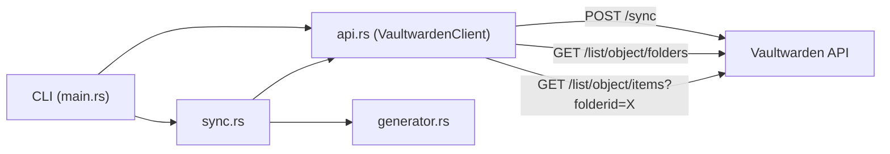
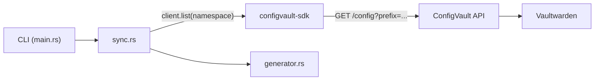

# Refactor vaultwarden-sync to Use ConfigVault Rust SDK

## Current Architecture

The project directly calls Vaultwarden's REST API via a hand-rolled blocking HTTP client:




Key pain points:

- Manual folder-name-to-ID resolution ([api.rs](E:\projects\vaultwarden-sync\src\api.rs) `list_folders` + [main.rs](E:\projects\vaultwarden-sync\src\main.rs) `resolve_folder_id`)
- Explicit `POST /sync` call before every fetch
- Raw HTTP status handling with `anyhow::bail!`
- Blocking HTTP only; no typed error variants

## Target Architecture




ConfigVault already handles vault syncing and folder-to-namespace mapping internally. The SDK's `list(namespace)` call returns a `HashMap<String, String>` -- exactly the trigger/replacement pairs needed.

## Change Summary

### 1. `Cargo.toml` -- update dependencies

- Add `configvault-sdk` as a path dependency (or git/crates.io once published):

```toml
  configvault-sdk = { path = "../config-vault/sdks/rust" }
  

```

- Add `tokio` runtime (the SDK is async):

```toml
  tokio = { version = "1", features = ["rt-multi-thread", "macros"] }
  

```

- Remove `reqwest` (the SDK brings its own)
- Keep: `serde`, `serde_json`, `serde_yaml`, `clap`, `anyhow`, `dirs`, `tempfile`, `chrono`

### 2. Delete `src/api.rs` entirely

The entire `VaultwardenClient` with its 190 lines of raw HTTP calls, response structs (`ListItemsResponse`, `ListItemsData`, `VaultItem`, `ListFoldersResponse`, `VaultFolder`), and manual error handling is replaced by the SDK.

### 3. `src/main.rs` -- simplify orchestration

**Remove:**

- `mod api;` declaration
- `resolve_folder_id()` function (~30 lines) -- ConfigVault uses namespace strings directly
- The `client.sync()` pre-fetch step
- `VaultwardenClient::new(endpoint)` creation in `run_sync`

**Add:**

- `#[tokio::main]` on `main()` (make it `async fn main()`)
- `--api-key` CLI arg (or `CONFIGVAULT_API_KEY` env var fallback)
- `api_key` field to `SyncArgs` and `InitArgs`
- ConfigVault SDK client construction: `ConfigVaultClient::new(&endpoint, &api_key)`

**Change:**

- `--folder-name` becomes `--namespace` (or keep `--folder-name` as alias for backward compat)
- `--endpoint` default changes from `http://100.95.211.8:3010` to ConfigVault's URL (e.g. `http://localhost:8083`)
- `run_sync()` and `run_init()` become `async fn`

### 4. `src/sync.rs` -- replace data fetching

**Current flow** (lines 26-52):

```rust
let client = VaultwardenClient::new(options.endpoint);
let items = client.list_items(&options.folder_id)?;
let matches: Vec<EspansoMatch> = items.into_iter().filter_map(|item| { ... }).collect();
```

**New flow:**

```rust
let configs = client.list(&options.namespace).await?;
let matches: Vec<EspansoMatch> = configs
    .into_iter()
    .filter(|(_, value)| !value.trim().is_empty())
    .map(|(key, value)| EspansoMatch { trigger: sanitize_trigger(&key), replace: value })
    .collect();
```

Changes to `SyncOptions`:

- `endpoint: String` -> removed (client passed in instead)
- `folder_id: String` -> `namespace: String`
- Add `client: &ConfigVaultClient` parameter to `run_sync()`

Make `run_sync` async.

### 5. `src/config.rs` -- add `api_key` support

Add an `api_key` field to `AppConfig`. For security, support reading it from the `CONFIGVAULT_API_KEY` environment variable as a higher-priority fallback (never required to be stored in the config file). Update the default endpoint.

### 6. `src/generator.rs` -- no changes

The generator only cares about `Vec<EspansoMatch>` and file I/O. It is unaffected by this refactoring.

### 7. Error handling improvement

Replace generic `anyhow::bail!` on HTTP errors with pattern matching on `ConfigVaultError` variants from the SDK:

```rust
match client.list(&namespace).await {
    Ok(configs) => { /* ... */ }
    Err(ConfigVaultError::Authentication) => bail!("Invalid API key"),
    Err(ConfigVaultError::ServiceUnavailable) => bail!("ConfigVault service unavailable"),
    Err(e) => return Err(e.into()),
}
```

## Files Changed


| File                                                              | Action                                                   |
| ----------------------------------------------------------------- | -------------------------------------------------------- |
| [Cargo.toml](E:\projects\vaultwarden-sync\Cargo.toml)             | Add `configvault-sdk` + `tokio`; remove `reqwest`        |
| [src/api.rs](E:\projects\vaultwarden-sync\src\api.rs)             | **Delete**                                               |
| [src/main.rs](E:\projects\vaultwarden-sync\src\main.rs)           | Async runtime, remove folder resolution, add API key arg |
| [src/sync.rs](E:\projects\vaultwarden-sync\src\sync.rs)           | Use SDK `list()` instead of raw API; make async          |
| [src/config.rs](E:\projects\vaultwarden-sync\src\config.rs)       | Add `api_key` field, update default endpoint             |
| [src/generator.rs](E:\projects\vaultwarden-sync\src\generator.rs) | No changes                                               |


## Dependency: Rust SDK must be built first

This plan depends on the ConfigVault Rust SDK plan being executed first (`sdks/rust/` in config-vault). The SDK must expose at minimum `ConfigVaultClient::new()`, `client.list()`, and the `ConfigVaultError` enum.